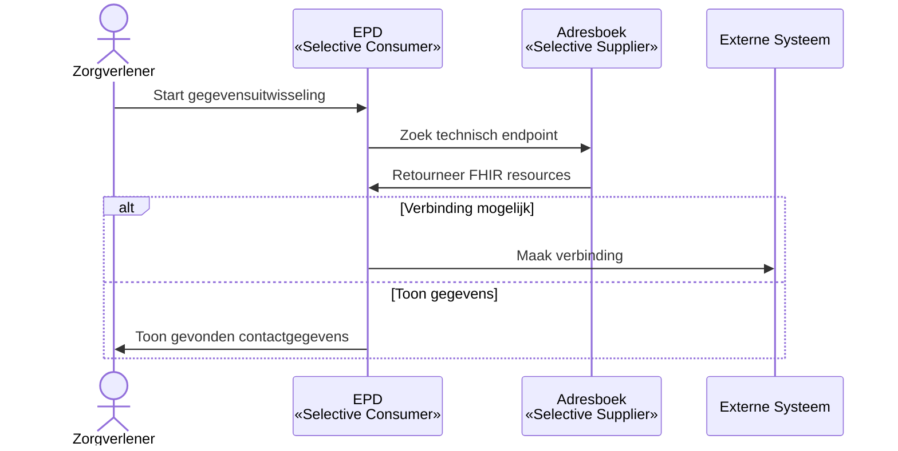
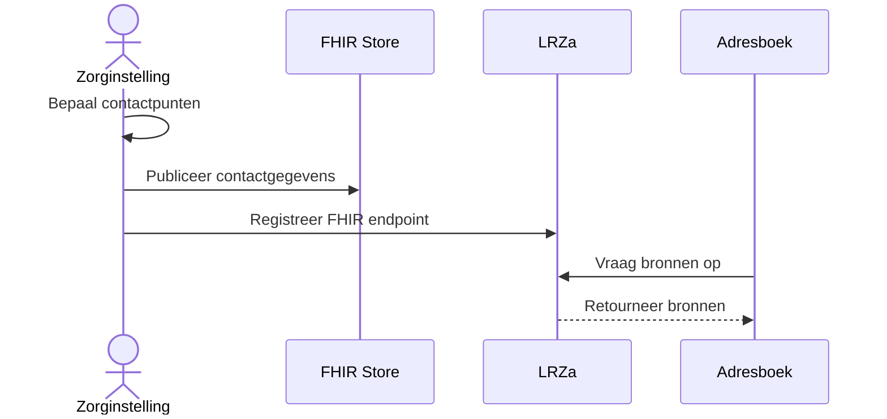

# Adressering

## Inleiding

De generieke functie adressering heeft als doel het mogelijk te maken om
communicatie kanalen (technische endpoints etc.) van partijen in het zorgveld te
vinden.

## Afkortingen en Begrippen

- **API**: Application Programming Interface
- **EPD**: Elektronisch Patiëntendossier
- **FHIR**: 'Fast Healthcare Interoperability Resources' internationale
  standaard voor het uitwisselen van gegevens in de zorg
- **FHIR mCSD**: Het Mobile Care Services Discovery (mCSD)-profiel voor FHIR
  ondersteunt een federatief systeem voor het vinden van adresgegevens van
  zorgorganisaties.
- **IHE**: 'Integrating the Healthcare Enterprise' is een
  standaardontwikkelorganisatie.
- **ITI-90**: IHE ITI-90 Find Matching Care Services transactie voor het
  opzoeken van care services
- **ITI-91**: IHE ITI-91 Request Care Services Updates transactie voor het
  opvragen van updates
- **LRZa**: Landelijk Register Zorgaanbieders
- **mCSD**: The Mobile Care Services Discovery (mCSD), Profiel dat RESTful
  queries op gerelateerde zorgdiensten ondersteunt.
  [Zie mCSD documentation](https://build.fhir.org/ig/IHE/ITI.mCSD/)

## Gebruikscasussen

De onderstaande gebruikscasussen beschrijven beheer, registratie van data en
opzoekmogelijkheden.

### Organisatie informatie vinden

De generieke functie adressering geeft antwoord op de vraag via welke contact
punten informatie uitgewisseld kan worden. Dit kunnen fysieke locaties zijn
(adresgegevens) maar is vooral gericht op het beschikbaar maken van technische
endpoints waarmee software systemen met elkaar kunnen communiceren. De
onderstaande gebruikscasus geeft een globaal beeld van het opzoeken van
gegevens.

1. Een zorgverlener start een gegevensuitwisseling met een andere organisatie.
2. Het EPD zoekt (IHE mCSD Selective Consumer) naar het technische endpoint voor
   de gegevensuitwisseling. Om dit te doen stelt het EPD een vraag aan een
   adresboek (IHE mCSD Selective Supplier).
3. De zoekopdracht wordt door het adresboek uitgevoerd en levert de FHIR
   resources die matchen met de zoekopdracht.
4. Het EPD gebruikt de gevonden informatie om verbinding te maken met het
   systeem van de andere organisatie.

Het onderstaande diagram geeft een vereenvoudigd overzicht van het
adresseringsproces.



### Registratie van adresgegevens

Zorginstellingen hebben een verantwoordelijkheid om zelf te bepalen welke
contact punten zij ter beschikking stellen. Dit kunnen zij doen door het
publiceren van de contact gegevens via een FHIR endpoint wat het IHE mCSD
profiel ondersteund. In het specifiek is deze endpoint een Update Supplier. Deze
endpoint dient bij het LRZa bekend gemaakt te worden.

1. Een zorginstelling bepaalt welke contactpunten beschikbaar worden gesteld.
2. De zorginstelling publiceert de contactgegevens via een FHIR endpoint (IHE
   mCSD Update Supplier).
3. Het FHIR endpoint wordt bij het LRZa geregistreerd.
4. Adresboek systemen kunnen het LRZa bevragen om bronnen van adresgegevens te
   vinden.



### Actualisatie van adresboeken

Op deze wijze kunnen adresboek systemen (Update Consumer & Update Supplier rol)
het LRZa bevragen voor alle bronnen van adresgegevens. Deze maken contact met
het LRZa om de volledige lijst op te halen. Vervolgens controleren ze bij elk
endpoint of er wijzigingen zijn. Indien dat het geval is worden deze wijzigingen
verwerkt.

Het actualiseren van adresgegevens verloopt via de volgende stappen:

1. Het adresboek systeem vraagt aan het LRZa om een lijst van alle bronnen.
2. Voor elke bron controleert het adresboek systeem of er wijzigingen zijn.
3. Als er wijzigingen zijn worden deze opgehaald via het FHIR endpoint.
4. De wijzigingen worden verwerkt in het adresboek systeem.
5. Het adresboek systeem is nu actueel en kan gebruikt worden voor het opzoeken
   van endpoints.
6. Dit proces wordt periodiek herhaald om de actuele stand van zaken te
   behouden.

```mermaid
sequenceDiagram
    participant Adresboek as Adresboek<br>«Update Consumer»
    participant LRZa
    participant Update Supplier as FHIR Store<br>«Update Supplier»

    Adresboek->>LRZa: Vraag lijst van bronnen
    LRZa-->>Adresboek: Retourneer lijst
    loop Voor elke bron
        Adresboek->>Update Supplier: Controleer wijzigingen
        alt Wijzigingen beschikbaar
            Update Supplier-->>Adresboek: Retourneer wijzigingen
            Adresboek->>Adresboek: Verwerk wijzigingen
        end
    end
    Note over Adresboek: Systeem is nu actueel
    Note over Adresboek: Herhaal periodiek
```

## Architectuur

[FHIR mCSD](https://profiles.ihe.net/ITI/mCSD/index.html) is het basismodel voor
de architectuur voor de generieke functie adressering. Binnen mCSD zijn er twee
kenmerkende onderdelen:

1. een definitie van entiteiten
2. uitrol mogelijkheden

Een belangrijk ontwerpprincipe van deze architectuur is de focus op
(relatief)statische adresgegevens. Het adresboek bevat alleen informatie die
niet vaak wijzigt. Concreet betekend dit dat het niet meerdere keren per dag
wordt aangepast. Een voorbeeld hiervan is een FHIR endpoint. Het aantal vrije
bedden is een voorbeeld van het type gegevens wat niet geschikt is voor het
adresboek, deze gegevens wijzigen te snel. Dit betekent dat:

- De generieke functie adressering niet bedoeld is voor real-time
  gegevensuitwisseling
- Wel kunnen via deze functie technische adressen opgezocht worden
- Met deze technische adressen kunnen vervolgens real-time gegevens worden
  opgevraagd bij de betreffende systemen

Het onderstaande diagram geeft een overzicht van de betrokken systemen:


### Entiteiten

M.b.t. het eerste punt, entiteiten, wordt uitgegaan van ondersteuning van
tenminste de volgende entiteiten:

- Organization
- Affiliation
- Endpoint
- Service
- Location
- Facility

> **Opmerking:** de architectuur werkgroep voor adressering werkt aan een
> verdere uitwerking van de entiteiten en de invulling hiervan.

### Uitrol

FHIR mCSD kent verschillende rollen aan de betrokken systemen toe. Dit zijn:

1. Selective Consumer
2. Selective Supplier
3. Update Consumer
4. Update Supplier

De selective consumer en supplier rollen (punt 1 en 2) hebben betrekking op de
opzoekvraag. De consumer is het vragende systeem. De supplier is het antwoord
gevende systeem.

Voor de update consumer en update supplier geldt dat dit rollen zijn ter
ondersteuning van een architectuur waarbij met replicatie van gegevens gewerkt
wordt. In de uitwerking van de generieke functie adressering wordt hier gebruik
van gemaakt.

Bij de uitrol wordt uitgegaan van de volgende onderdelen:

1. Centraal overzicht van leveranciers van adresboekgegevens
2. Leveranciers van adresboek gegevens
3. Adresboek(en)
4. Synchronisatie applicatie(s)

De leveranciers van adresboekgegevens corresponderen met de FHIR mCSD Update
Supplier rol. Het onder punt 3 benoemde adresboek realiseert de Selective
Supplier functionaliteit. Deze doet dat via een eigen opslag die gevuld wordt
middels de in punt 4 benoemde synchronisatie applicatie.

Voor het bepalen van alle leveranciers van adresboek gegevens is een centrale
lijst nodig. Deze wordt gerealiseerd door middel van het in punt 1 genoemde
centrale overzicht.

## Koppelvlakken voor opzoeken

Het zoeken van adresseerbare punten gaat op basis van
[FHIR mCSD ITI-90](https://profiles.ihe.net/ITI/mCSD/ITI-90.html). Een systeem
welke de noodzaak heeft gegevens uit het adresboek te raadplegen zal, als
Selective Consumer, verbinding maken met het adresboek en vervolgens op basis
van de specificaties uit ITI-90 een vraag stellen. Het adresboek, welke als
Selective Supplier optreed, zal het antwoord leveren.

Een randvoorwaarde is dat het adres van het adresboek zelf via eerdere
handmatige configuratie bekend gemaakt is aan het systeem.

## Koppelvlakken registratie

Voor registratie van adresboek gegevens zijn twee afzonderlijke registratie
stappen vereist:

1. registratie van Update Supplier adres
2. leveren van FHIR mCSD entiteiten (organisatie, locatie, endpoint etc.
   informatie)

> **Opmerking:** Registratie van het Update Supplier adres wordt nog uitgewerkt
> binnen de architectuur werkgroep.

### Levering van FHIR mCSD entiteiten

Het koppelvlak voor het leveren van FHIR mCSD entiteiten gaat uit van een
standaard FHIR API. [ITI-91](https://profiles.ihe.net/ITI/mCSD/ITI-91.html)
geeft gedetailleerde specificaties over de werking. Kenmerkend is het gebruik
van de [history](http://hl7.org/fhir/R4/http.html#history) in combinatie met de
`since` parameter voor het efficiënt kunnen ophalen van data via een "poll"
mechanisme.

> **Opmerking:** De werkgroep architectuur heeft nog geen besluit genomen over
> authenticatie / autorisatie op dit koppelvlak.
