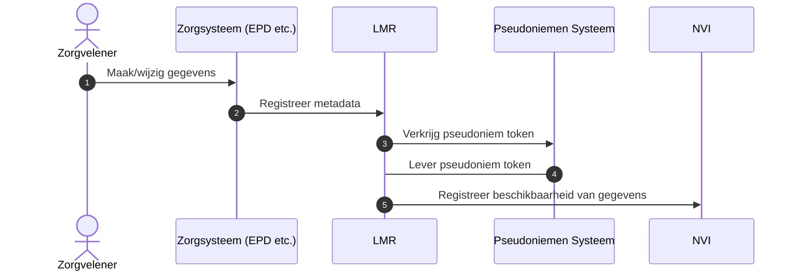
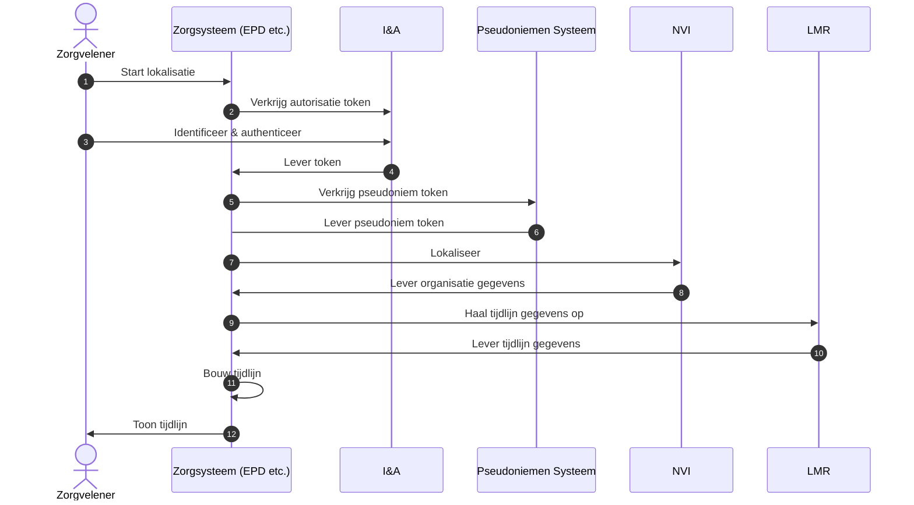

# Technisch

## Zorgdata registratie

Dit subsysteem biedt zorgaanbieders de mogelijkheid om beschikbaarheid van
zorgdata te registreren. Hiervoor is een REST API beschikbaar. Deze API maakt
het mogelijk om:

- beschikbaarheid van zorgdata te registreren
- beschikbaarheid van zorgdata te verwijderen
- op te vragen welke data geregistreerd is

## Zorgdata lokalisatie

Het subsysteem dat de "waar" vraag beantwoord voor zorgsystemen (EPD's etc.) is
de opzoek-API. Deze kan op basis van een zoekvraag een antwoord gegeven over
welke zorgaanbieders data hebben die bij de vraag past.

Hieronder staat een schematische weergave van de stappen in het opzoek proces in
samenhang met andere systemen.

## API-standaard

Hoewel binnen de zorg vooral met FHIR gewerkt wordt zal de NVI een eigen
standaard gebruiken. De reden hiervoor is dat FHIR geen logisch concept heeft
wat correspondeert met de NVI-behoeften.

Deze API van de NVI zal, in lijn met het [Forum
Standaardisatie](https://www.forumstandaardisatie.nl/open-standaarden/rest-api-design-rules)
als REST API worden aangeboden.
