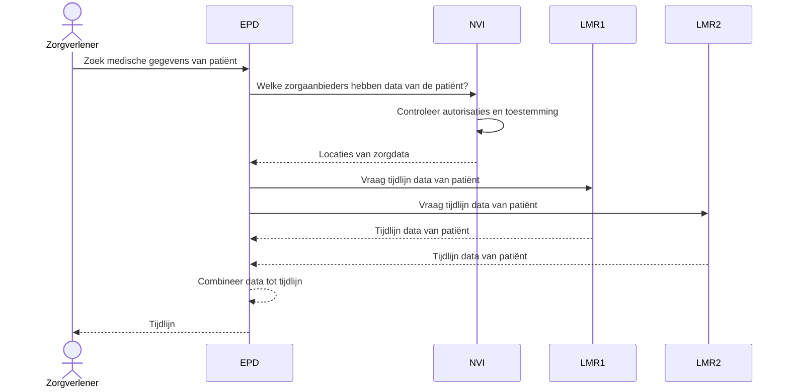
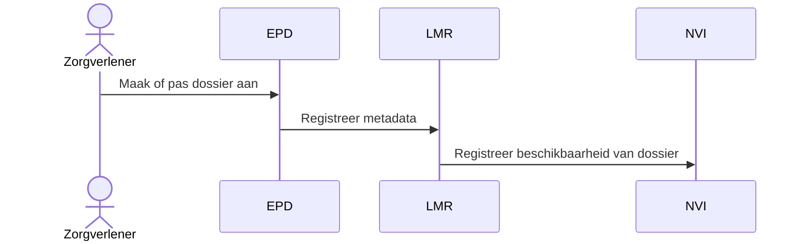
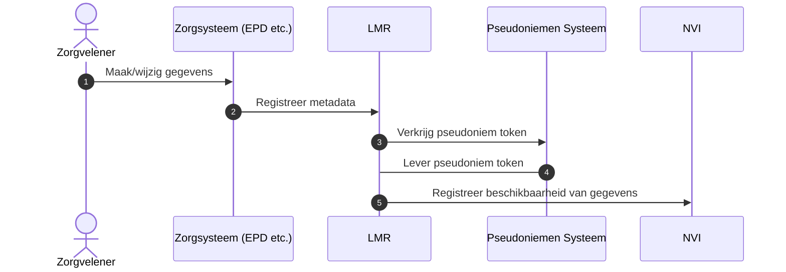
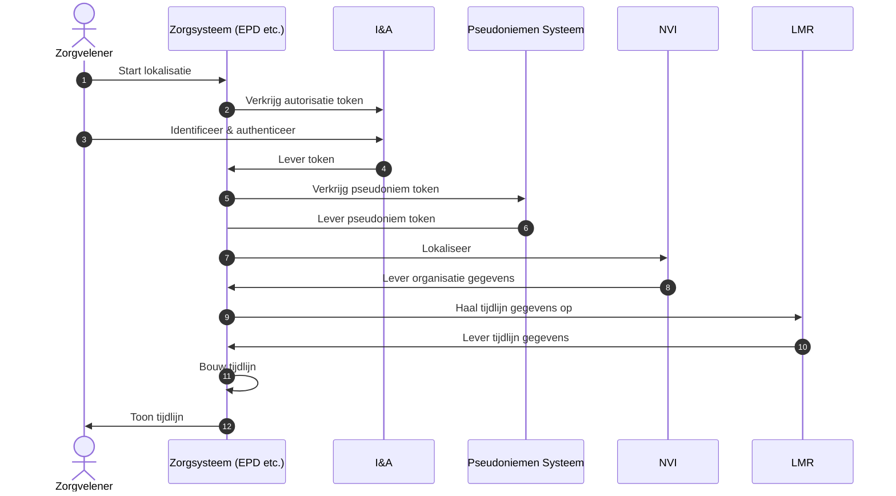

# Lokalisatie

## Inleiding

Binnen de huidige zorg-IT infrastructuur is het, voor de meeste uitwisselingen,
niet mogelijk om een overzicht te krijgen van de beschikbare gegevens die bij
verschillende zorgaanbieders beschikbaar zijn. De generieke functie Lokalisatie
zorgt dat deze vraag wel beantwoord kan worden door aan te geven waar en welke
data beschikbaar is over een patiënt.

Het lokalisatie proces omvat verschillende systemen die de volgende vragen
beantwoorden:

1. Waar is data over deze patiënt te vinden?
2. Hoe kan deze data opgehaald worden?
3. Welke data is dit?

Lokalisatie kan plaatsvinden voor:

1. Zorgverlener
2. Burger

Deze documentatie richt zich primair op het eerste scenario. De reden hiervoor
is dat de zorgverlener casus vereist dat er een context gebruikt kan worden als
filter. Voor burgerlokalisatie kunnen ook systemen gebruikt worden die geen
filter mogelijkheid op uitwisseling hebben. Ook is identificatie en autorisatie
bij de burger anders.

## Afkortingen en Begrippen

- **API**: Application Programming Interface
- **BSN**: Burgerservicenummer
- **EPD**: Elektronisch Patiëntendossier
- **FHIR**: 'Fast Healthcare Interoperability Resources' internationale
  standaard voor het uitwisselen van gegevens in de zorg
- **I&A**: Identificatie & Authenticatie
- **LMR**: Lokalisatie Metadata Register, een bron systeem voor de in de
  tijdlijn benodigde data
- **NEN**: Stichting Koninklijk Nederlands Normalisatie Instituut (genoemd in
  NEN traject voor lokalisatie)
- **NVI**: Nationale VerwijsIndex
- **PRS**: Pseudoniemen Referentie Service
- **REST API**: Representational State Transfer API, is een set regels voor het
  verzenden van gegevens tussen een client en server
- **Zorgaanbieder**: Instelling of organisatie die zorg aanbiedt

## Gebruikscasussen

De onderstaande gebruikscasussen beschrijven beheer, registratie van data en
opzoekmogelijkheden.

### Lokalisatieproces

De generieke functie lokalisatie geeft antwoord op de vraag waar zorggegevens
van een patiënt gevonden kunnen worden. Om dit te kunnen doen is een centrale
index nodig. Deze gebruikscasus beschrijft hoe de NVI deze rol vervult:

1. Een zorgverlener is op zoek naar medische gegevens van een patiënt.
2. Deze vraagt het EPD om deze te lokaliseren.
3. Het EPD vraagt de NVI welke zorgaanbieders data van de patiënt hebben.
4. De NVI controleert de autorisaties en toestemming.
5. Indien akkoord, geeft de NVI aan waar deze data te vinden is.

In aanvulling hierop zal binnen het lokalisatie proces ook de volgende stappen
plaatsvinden:

1. Het EPD haalt bij de verschillende LMR de tijdlijngegevens op.
2. In het EPD worden de gegevens gecombineerd en gepresenteerd.

Het onderstaande diagram geeft een vereenvoudigd overzicht van het
lokalisatieproces.

### Zorgdata registratie

1. Een zorgverlener maakt of past een dossier aan.
2. Het LMR ontvangt deze dossier bijwerking.
3. Het LMR registreert de beschikbaarheid van het dossier bij de NVI.

## Architectuur

De architectuur voor lokalisatie bestaat uit / maakt gebruik van de volgende
onderdelen:

- Nationale Verwijs Index (NVI)
- Lokalisatie Metadata Register (LMR)
- Pseudoniemen referentie service (PRS)
- De generieke functie adressering

Het onderstaande diagram geeft een overzicht van de betrokken systemen bij
lokalisatie:

### NVI

De Nationale Verwijs Index (NVI) beantwoordt de vraag waar er data over een
patient is. Dit is een centrale index die de volgende gegevens bevat:

- enkel bij de NVI bekend pseudoniem van de patiënt
- identificatie code van zorgaanbieder
- zorgcontext (bijvoorbeeld de uitwisseling)

Ook biedt het systeem filtermogelijkheden om het antwoord te beperken tot de
specifieke uitwisseling. Dit voorkomt dat een arts meer informatie krijgt dan
nodig is voor de behandeling.

### LMR

Het lokalisatie metadata register (LMR) is een specificatie voor een bronsysteem
wat de gegevens levert die nodig zijn voor het opbouwen van de tijdlijn.
Technisch betekent dit een systeem wat via FHIR te bevragen valt. Aanvullend
zijn er specificaties over de FHIR resources die aanwezig geacht worden en de
velden die daarbij beschikbaar gesteld dienen te worden.

In de architectuur wordt ervan uit gegaan dat er binnen de zorg
FHIR-implementaties in gebruik zijn die geschikt zijn voor de LMR rol. Het is
echter ook mogelijk om een apart systeem hiervoor te (laten) inrichten.

### PRS

Als privacy verhogende maatregel zal de NVI zelf geen BSN verwerken. Om toch een
lokalisatie vraag te kunnen beantwoorden zal er gewerkt worden met een
pseudoniem. De pseudoniemen referentie service (PRS) heeft als taak dit
pseudoniem te maken.

### Adressering

Een van de stappen in het lokalisatie proces is het vinden van de LMR endpoints
op basis van het organisatie ID. Hiervoor zal gebruik gemaakt worden van de
adresseringsfunctie.

## Technisch

### Zorgdata registratie

Dit subsysteem biedt zorgaanbieders de mogelijkheid om beschikbaarheid van
zorgdata te registreren. Hiervoor is een REST API beschikbaar. Deze API maakt
het mogelijk om:

- beschikbaarheid van zorgdata te registreren
- beschikbaarheid van zorgdata te verwijderen
- op te vragen welke data geregistreerd is

### Zorgdata lokalisatie

Het subsysteem dat de "waar" vraag beantwoord voor zorgsystemen (EPD's etc.) is
de opzoek-API. Deze kan op basis van een zoekvraag een antwoord gegeven over
welke zorgaanbieders data hebben die bij de vraag past.

Hieronder staat een schematische weergave van de stappen in het opzoek proces in
samenhang met andere systemen.

### API-standaard

Hoewel binnen de zorg vooral met FHIR gewerkt wordt zal de NVI een eigen
standaard gebruiken. De reden hiervoor is dat FHIR geen logisch concept heeft
wat correspondeert met de NVI-behoeften.

Deze API van de NVI zal, in lijn met het
[Forum Standaardisatie](https://www.forumstandaardisatie.nl/open-standaarden/rest-api-design-rules)
als REST API worden aangeboden.

## Koppelvlakken NVI

De NVI heeft twee koppelvlakken:

1. Opzoeken
2. Registreren

Dit document beschrijft beide koppelvlakken in termen van interactie en data.
Het verwijst ook naar de technische details (API specificaties) voor beide
koppelvlakken.

### Opzoeken

Een zoekvraag voor de NVI dient de volgende gegevens te bevatten:

1. Autorisatie
   - Identificatie van de zorgverlener
   - Identificatie van de zorgaanbieder
2. Lokalisatievraag
   - Beoogde uitwisseling
   - Patiëntidentificatie

> **Opmerking:** Het autorisatiegedeelte is nog niet uitgewerkt. Dit wacht op
> besluitvorming uit de I&A werkgroep.

#### Lokalisatievraag

De lokalisatievraag bestaat uit de beoogde uitwisseling (beeld, medicatie, etc.)
en identificatie van de patiënt. Elke uitwisseling krijgt een code die gebruikt
kan worden in de lokalisatievraag.

> **Opmerking:** Er is nog geen codelijst voor de uitwisselingen vastgesteld.

Voor de identificatie van de patiënt zal binnen de NVI gebruik gemaakt worden
van een pseudoniem. Dit pseudoniem is uniek voor de NVI. Om de NVI te bevragen,
zal daarom een _token_ voor de patiënt opgehaald moeten worden bij het
pseudoniemen systeem.

#### Resultaat van lokalisatievraag

Het resultaat van een lokalisatievraag is een lijst (mogelijk leeg) met daarin
de relevante gegevens.

### Registreren

Voordat data via het opzoeken gevonden kan worden, dient deze eerst
geregistreerd te worden. Dit kan via het aanroepen van de registratiefunctie op
de NVI. Voor deze functie zijn de volgende gegevens nodig:

1. Autorisatie
   - Identificatie van de zorgaanbieder
2. Registratiegegevens
   - Uitwisseling
   - Patiëntidentificatie
3. Type operatie (registreren / verwijderen)

De gegevens uit de identificatie worden gebruikt voor toegangsverlening en
registratie.

> **Opmerking:** Zie de opmerkingen bij opzoeken voor openstaande onderwerpen.

Bij de registratie van de gegevens (uitwisseling en patiëntidentificatie) zal
ook de organisatie vastgelegd worden. Hiervoor wordt op dit moment uitgegaan van
het URA als ID. Dit is voorlopig gekozen in afwachting van een definitieve keuze
uit de requirements en architectuur werkgroepen.

## Koppelvlakken LMR

De LMR heeft een koppelvlak voor het uitlezen. Dit is een reguliere FHIR API.
Per uitwisseling zijn er verschillende voorschriften voor de resources en hun
attributen die beschikbaar gesteld dienen te worden via deze API.

> **Opmerking:** De details m.b.t. de resources zijn nog niet vastgesteld in
> afwachting van het lopende NEN traject voor lokalisatie. Ook de FHIR versie is
> nog niet vastgesteld. Deze is in afwachting van een besluit uit de
> architectuur werkgroep.
